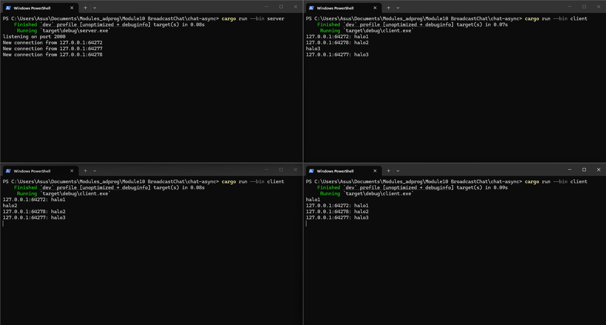
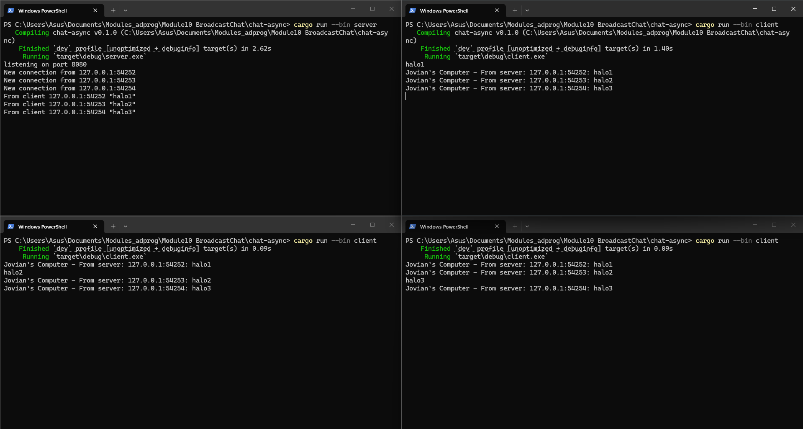

Hasil screenshot setelah menjalankan 3 client dan 1 server : 

Explanation 2.1 : 
Untuk menjalankan program, kita perlu membuka 4 terminal dengan satu terminal menjalankan server (cargo run --bin server) dab 3 lainnya menjalankan client (cargo run --bin client).

Berdasarkan gambar, ketika kita mengetik sebuah teks (misalnya "halo1", "halo2", atau "halo3") di salah satu client dan menekan enter, terjadi sebuah siklus komunikasi asynchronous dua arah:

- Di sisi Client (Pengirim): Karena makro tokio::select!, aplikasi client dapat memantau input keyboard dan aliran data dari jaringan secara bersamaan tanpa saling menunggu (non-blocking). Saat kita menekan Enter, tugas pertama menangkap teks "halo1" dari terminal dan langsung mengirimkannya ke server melalui WebSocket.

- Di sisi Server: Fungsi handle_connection di server menerima pesan tersebut dari stream WebSocket. Server kemudian merangkai ulang pesannya dengan menambahkan identitas alamat IP dan port si pengirim (menjadi format 127.0.0.1:64272: halo1). Setelah itu, server melempar pesan yang sudah diformat tersebut ke dalam channel broadcast (bcast_tx).

- Distribusi Pesan (Broadcast): Karena setiap client yang terhubung memiliki receiver (bcast_rx) yang subscribe ke channel yang sama, channel tersebut mendistribusikan pesan 127.0.0.1:64272: halo1 ke semua fungsi handler koneksi yang sedang berjalan di server.

- Di sisi Client (Penerima): Server meneruskan kembali pesan tersebut ke semua client (termasuk si pengirim aslinya) melalui koneksi WebSocket masing-masing. Tugas kedua pada tokio::select! di setiap terminal client mendeteksi adanya pesan masuk dari server, lalu mencetaknya ke layar terminal.

Explanation 2.2 : 
Mengubah konfigurasi port dari 2000 menjadi 8080 membutuhkan pembaruan di dua sisi sekaligus, yaitu sisi server dan sisi client. Hal ini terjadi karena komunikasi jaringan berbasis TCP/WebSocket mengharuskan adanya kesamaan titik komunikasi (endpoint) yang sama. Server bertindak sebagai penyedia layanan yang membuka jalur dan mendengarkan (listening) koneksi masuk pada port tertentu, sedangkan client bertindak sebagai pihak yang menginisiasi panggilan ke alamat IP dan port spesifik tersebut. Jika terjadi ketidakcocokan port—misalnya server mendengarkan di port 8080 tetapi client mencoba menghubungi port 2000—maka koneksi akan langsung gagal dan memicu error Connection Refused, karena tidak ada aplikasi yang menjembatani permintaan client di port lama tersebut.

Meskipun port-nya diubah, aplikasi ini tetap menggunakan protokol WebSocket yang sama, yaitu ws:// (WebSocket non-enkripsi). Definisi penggunaan protokol ini dapat ditemukan secara eksplisit di kedua file proyek. Di sisi client (client.rs), protokol didefinisikan langsung pada bagian string alamat URI, yaitu Uri::from_static("ws://127.0.0.1:8080"). Sementara di sisi server (server.rs), penggunaan protokol WebSocket didefinisikan melalui pemanggilan makro dan tokio_websockets, tepatnya pada baris ServerBuilder::new().accept(socket).await?. Fungsi dari baris tersebut adalah melakukan proses handshake untuk meningkatkan (upgrade) koneksi stream TCP mentah menjadi protokol komunikasi WebSocket agar fitur broadcast chat dapat berjalan secara real-time.

Screenshot hasil setelah ditambahkan nama pengirim : 

Explanation 2.3: 
Penempatan string penanda "Jovian's Computer - From server:" dilakukan di sisi client (client.rs) karena teks tersebut merupakan identitas lokal atau signature spesifik dari mesin fisik yang sedang menjalankan aplikasi. Dengan memproses format tampilan ini langsung di bagian penerimaan pesan milik client, string identitas lokal tersebut tidak perlu ikut dikirim dan membebani lalu lintas jaringan secara sia-sia. Selain itu, ini memberikan bukti bahwa teks yang muncul di terminal benar-benar merupakan hasil data yang berhasil menempuh perjalanan asinkron penuh dari server, bukan sekadar ketikan langsung dari keyboard lokal pengguna.

Sementara itu, pencetakan log println!("From client...") sengaja ditempatkan di sisi server (server.rs) tepat setelah mendeteksi pesan masuk karena server bertindak sebagai hub pusat (central broker) yang menjembatani seluruh koneksi. Sisi backend adalah satu-satunya lapisan yang memiliki visibilitas total untuk melacak asal-usul seluruh paket data berdasarkan kombinasi alamat IP dan nomor port pengirim. Menempatkan log di bagian ini sangat krusial untuk memvalidasi status aliran data (state verification) secara real-time, untuk memastikan bahwa pesan dari client telah sukses menyentuh lapisan aplikasi server dengan aman sebelum didistribusikan ke seluruh pengguna lain melalui channel broadcast.